---
lab:
  title: ILT Setup
  module: Introduction
  description: In this exercise, you will access the Microsoft Copilot Studio portal and create an environment and solution to use throughout the remaining labs.
  duration: 25 minutes
  level: 200
  islab: true
  primarytopics:
    - Microsoft Copilot
    - Microsoft Copilot Studio
---

## Exercise 1 Create a Power Platform environment

### Task 1.1 - Power Platform Admin Center

Before you start the lab exercises, you must create a development environment for you to work in.

1. Open a web browser and navigate to the **Power Platform admin center** https://admin.powerplatform.microsoft.com/manage/environments. Sign in using the **credentials provided for this lab**.   
1. If prompted, choose the option to stay signed in. Close any pop-up messages that are displayed.

### Task 1.2 - Create a new environment

1. In the sidebar, select **Manage**.
2. In the **Environments** page, select **+ New**.
   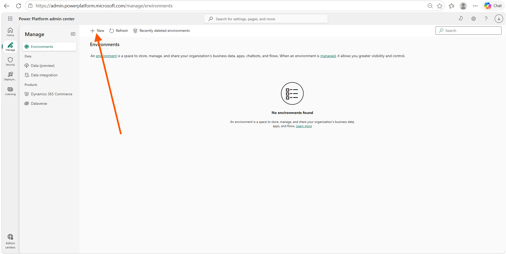
3. In the **New environment** panel, set **Type** to Trial and **Region** to the default region shown (a local region provides quicker data access).
   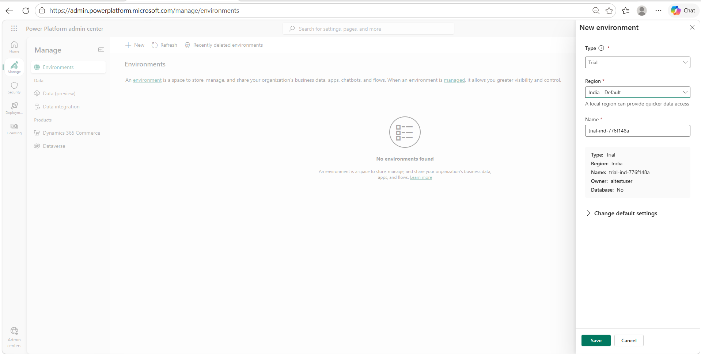
4. Enter your preferred name in the **Name** field.
   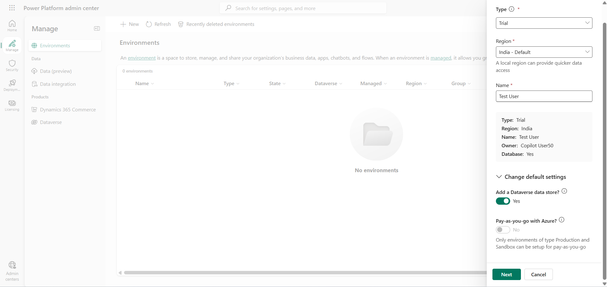
5. Expand **Change default settings**. Under **Add a Dataverse data store?**, select **Yes**.

   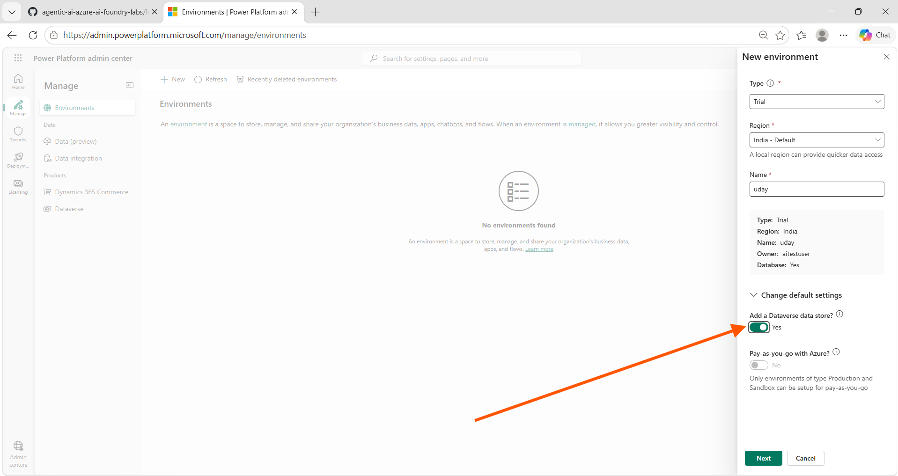

> [!NOTE]
> **Pay-as-you-go with Azure is unavailable for Trial environments. This setting is supported only for Production and Sandbox environments**.

6. Select **Next**. 

7. In the **Add Dataverse** panel, set the following:
   - **Language**: Leave it as **English (United States)** if it is already selected. Otherwise, select **English (United States)** and move to the next field.
   - **Currency**: leave as default
   - **Security group**: Click **+ Select** and in **Edit security group** find **open access** click **None** and Click **Done**
   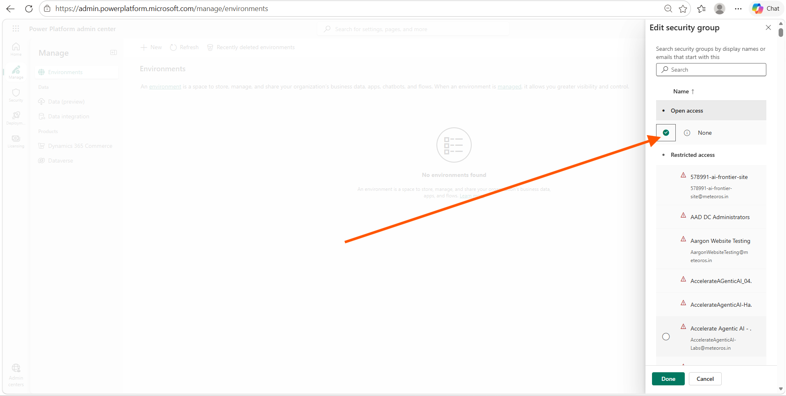
   - **URL**: No changes are required.
   - **Enable Dynamics 365 apps?**: leave as it is (locked to **No**), move to the next field
   - **Deploy sample apps and data?**: No

> [!NOTE]
> **Currency defaults based on your region (for example, INR for India). Enable Dynamics 365 apps is disabled for Trial environments and it's only available for Production or Sandbox environments**.  

   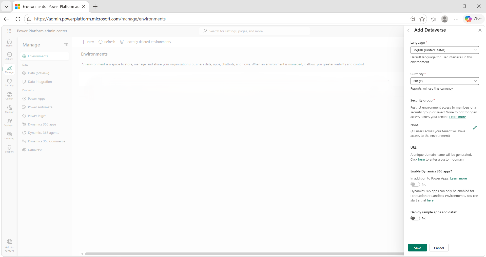

7. Select **Save** and wait for the environment state to change from **Preparing** to **Ready**. After some time, use **Refresh** to update the status.

> [!NOTE]
> **Environment provisioning can take several minutes depending on tenant configuration**.

   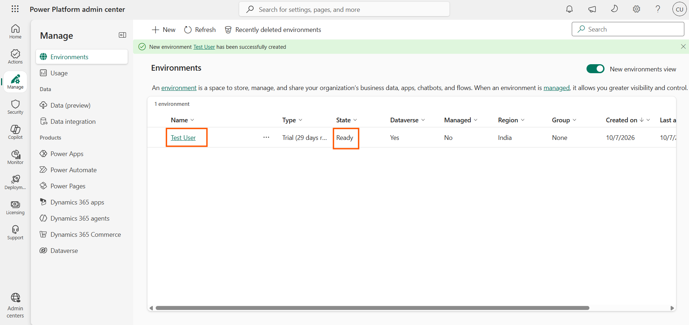

### Task 1.3 - Access Copilot Studio

1. In a new browser tab, open **Copilot Studio** https://copilotstudio.microsoft.com/ and sign in if prompted.

2. You will be redirected to the **new Copilot Studio UI**. This UI has fewer features than the **Classic Experience UI**. We will use the **Classic Experience UI** throughout the labs.

   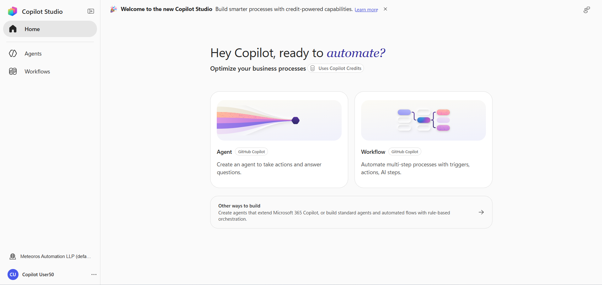

3. Select **...** (More options) at the bottom of the page. Under **Explore**, select **Open Classic Experience**, then select **Skip feedback**.

   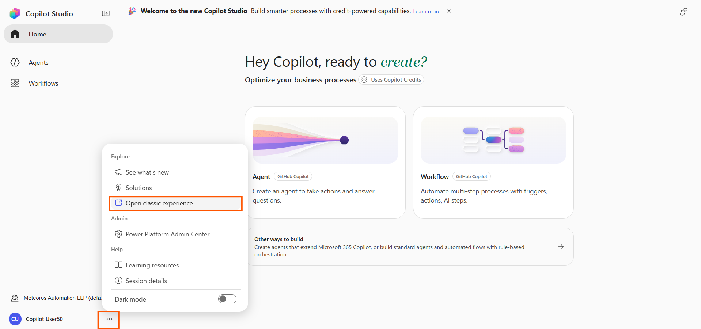

4. In the **upper-right corner** of the page, just to the left of the **Settings** ⚙️ icon, locate the **Environment Selector** showing the current environment.

   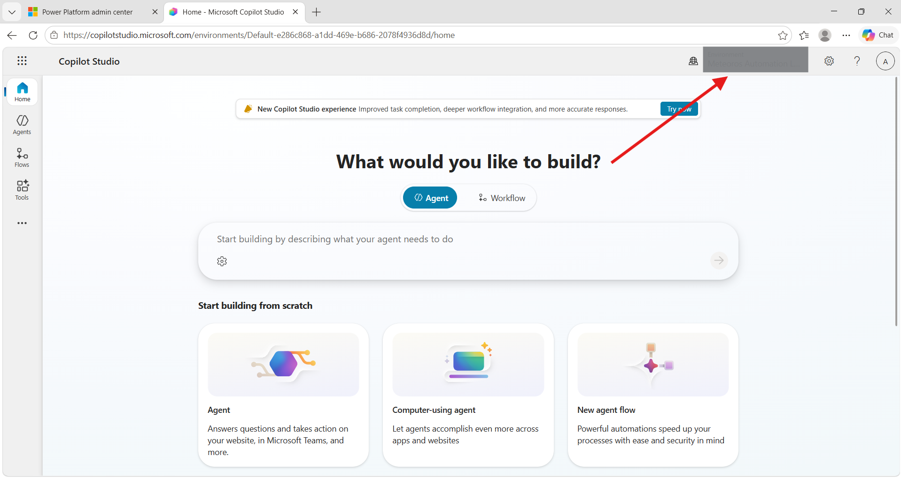

5. Select the **Environment Selector**.

   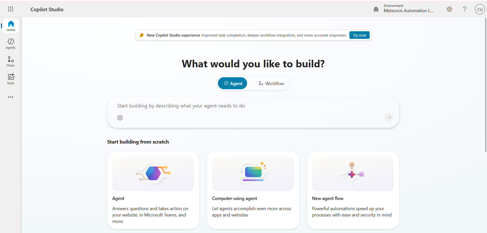

6. The **Select environment** menu will open.

   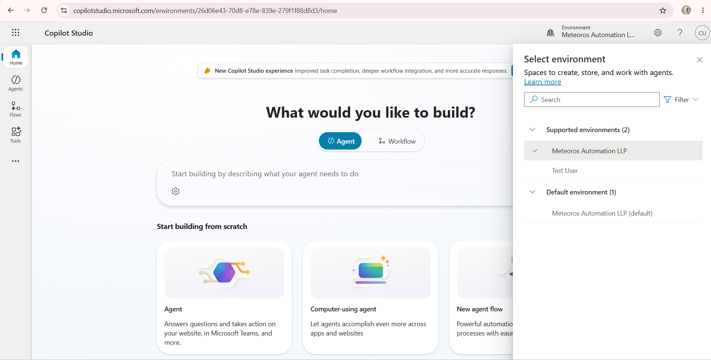

7. Under **Supported environments**, select your **named environment**.

   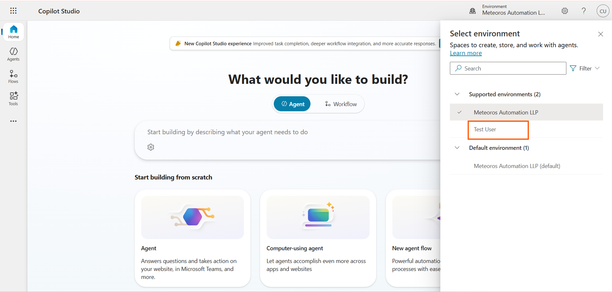

8. Your **named environment** should now be displayed in the **Environment Selector**.

   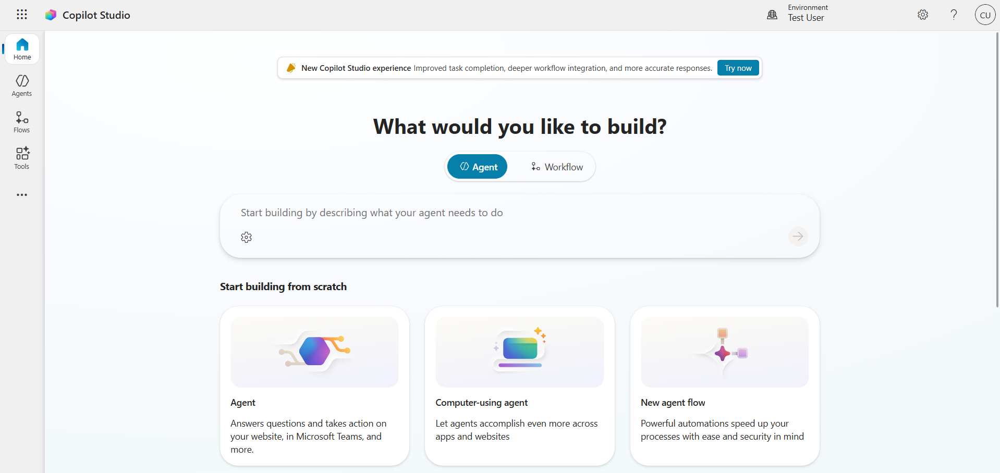

9. You are now in the correct **environment** and the **Classic Experience** UI is ready for the lab.

> [!TIP]
>
> **Remember these steps, as you will use them throughout the labs when you are redirected to the new UI or a different environment.**

### Task 1.4 - Create a solution

1. In the left navigation pane, select the ellipses (**...**), then select **Solutions**.
2. Verify that **Default Solution** and **Common Data Services Default Solution** are listed.

   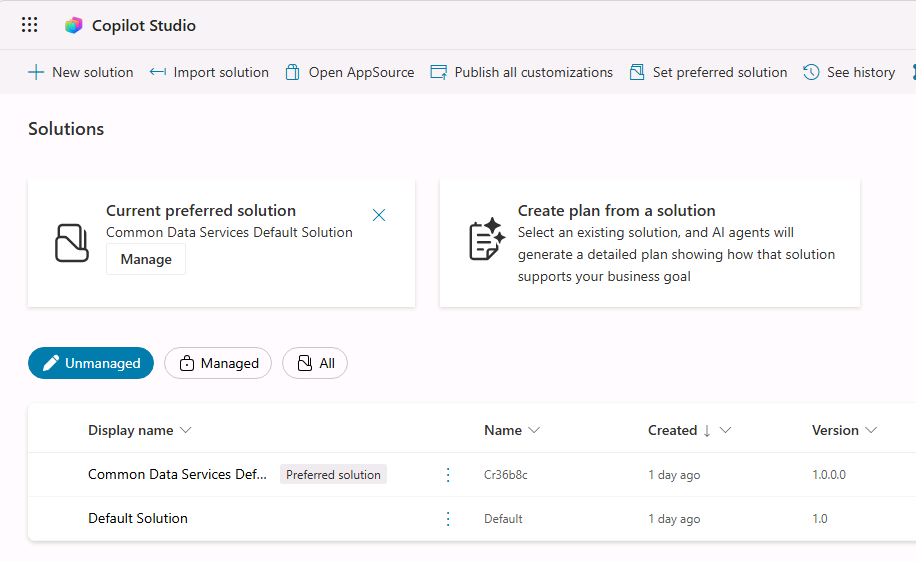

3. Select **+ New solution**.
4. Enter **`Lab Exercises`** in the **Display name** field. The **Name** field should automatically populate as **LabExercises**, with the space removed.
5. Select **+ New publisher** below the **Publisher** drop-down.
6. Enter **`Fabrikam_unique_Suffix`** for Display name, `fabrikam_unique_suffix` for Name, Leave the Description field empty and proceed to the next field, Prefix. Now fill `fab` for Prefix, then select **Save**.

   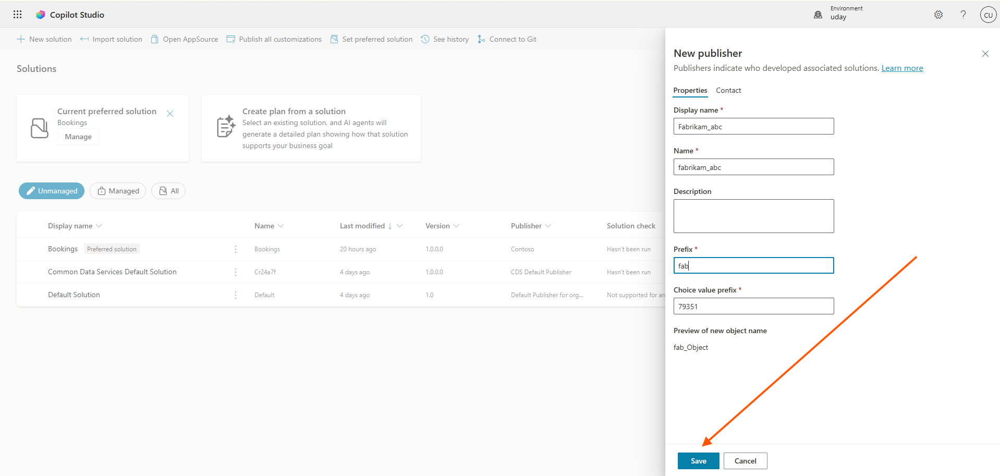
     
7. Confirm **Fabrikam_unique_suffix (fabrikam_unique_suffix)** is selected in the **Publisher** drop-down.
8. Leave **Version** as the default value.
9. Select the **Set as your preferred solution** checkbox.

> [!NOTE]
> Setting this as your preferred solution ensures new assets created during later labs are added to the Lab Exercises solution by default.

10. Select **Create**.

   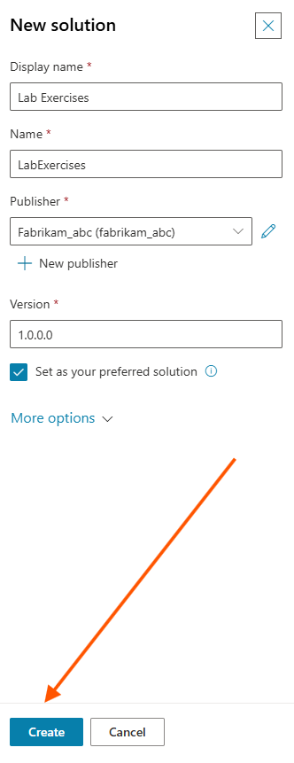

11. Close the **Solutions** browser tab by selecting the **←** icon in the left pane.

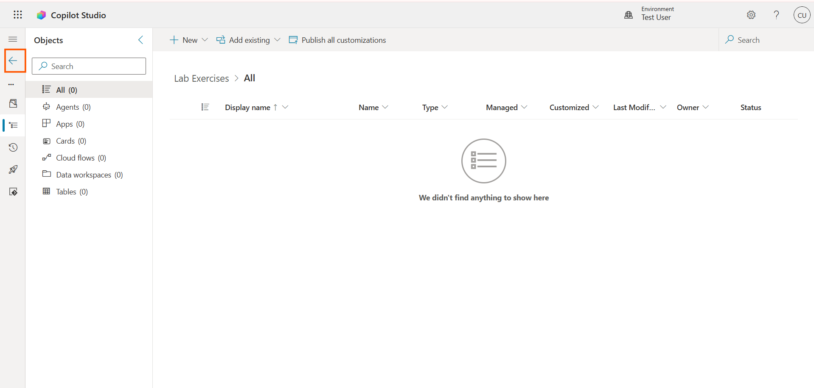

12. You now have a Power Platform environment and solution to work in.

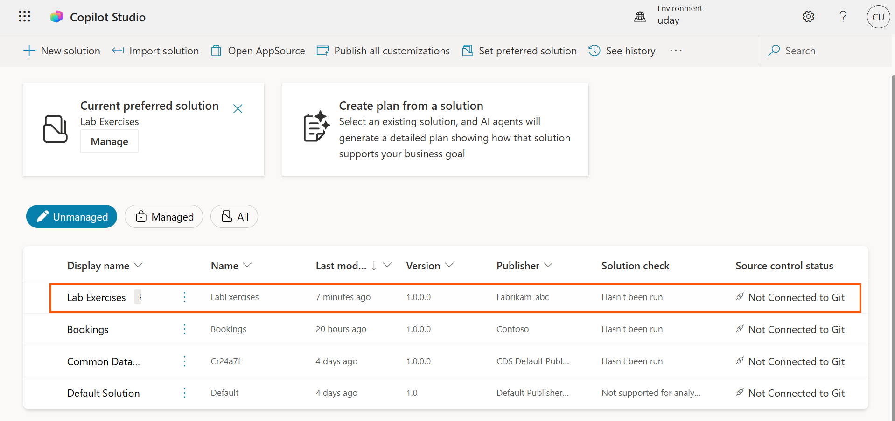

## Summary

In this exercise, you created a Power Platform trial environment with Dataverse, accessed Microsoft Copilot Studio, selected your environment, and created a **Lab Exercises** solution with a custom publisher. This environment and solution will be used throughout the remaining labs.
