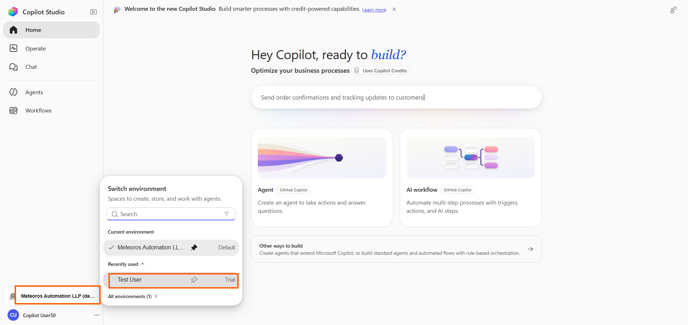
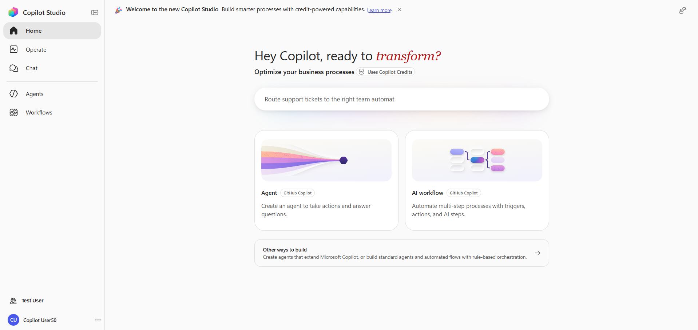
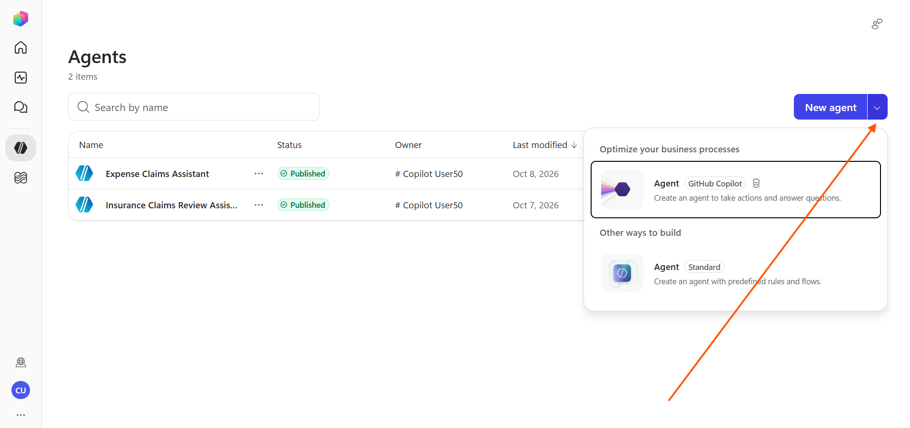
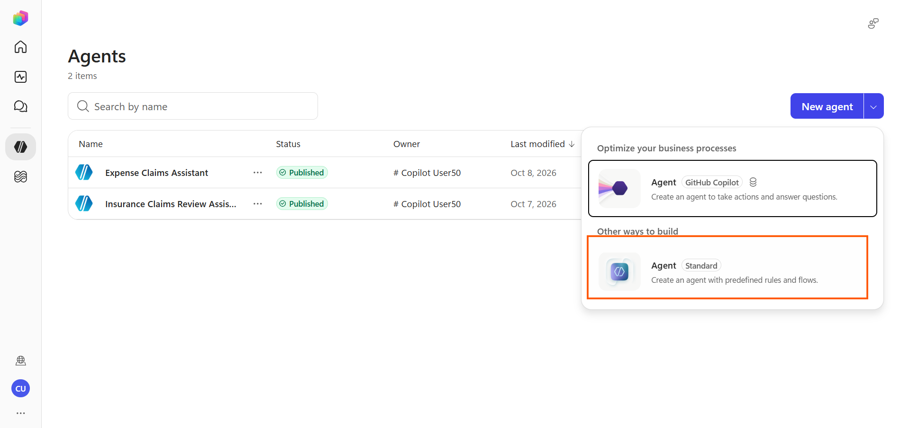
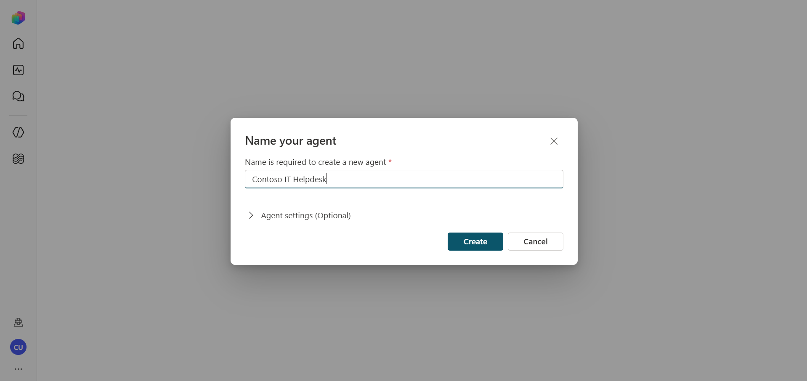
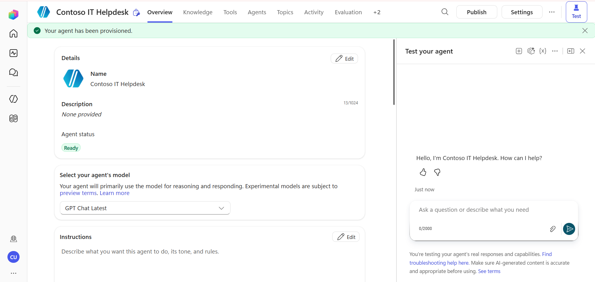
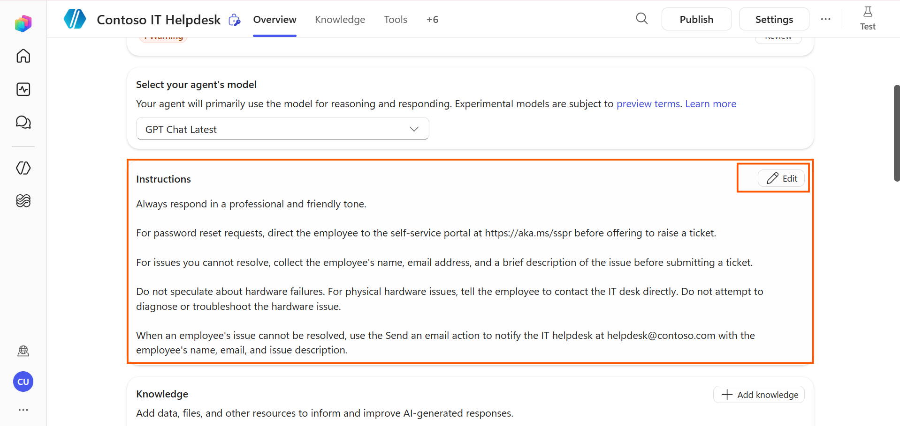

---
lab:
  title: Create an agent using the new Copilot Studio experience
  module: Create agents in Microsoft Copilot Studio
  description: In this lab, you will use the new Copilot Studio experience to create an instruction-driven agent, add a prebuilt action, and test autonomous reasoning behavior.
  duration: 30 minutes
  level: 200
  islab: true
  primarytopics:
    - Microsoft Copilot Studio
---

# Create an agent using the new Copilot Studio experience

## Scenario

In this exercise, you will:

- Switch to the new Copilot Studio experience
- Create an agent using natural language instructions
- Add a prebuilt action the agent can use autonomously
- Test the agent and observe its reasoning behavior
- Refine instructions based on test results

This exercise will take approximately **30** minutes to complete.

## What you will learn

- How the new Copilot Studio experience differs from the classic interface
- How to configure an agent using instructions instead of topic trees
- How the agent reasons autonomously to select knowledge and actions
- How to iterate on instructions to improve agent behavior

## High-level lab steps

- Switch to the new Copilot Studio experience
- Create an agent with a description
- Write and refine agent instructions
- Add a prebuilt action
- Test and iterate

## Prerequisites

- Have a Microsoft Entra ID account
- Have a Copilot Studio license or have signed up for a free trial
- Have access to a Power Platform environment and a solution where you can create agents and related assets.
- You can use:
  - the environment and **Lab Exercises** solution created in the **ILT Setup** lab, or
  - your own existing environment and solution.
- If you do not already have an environment and solution prepared, complete the steps in the **ILT Setup** lab before continuing.

> [!IMPORTANT]
> The new Copilot Studio experience is the redesigned interface that replaces the classic topic authoring canvas. Steps and screenshots in this lab reflect the new experience. If your environment shows the classic interface, follow the prompt to switch to the new experience before proceeding.

## Key concept: Instruction-driven agents

The new Copilot Studio experience replaces the topic authoring canvas with a simpler, instruction-driven model:

| Classic experience | New experience |
|---|---|
| Agent behavior defined by topic trees and trigger phrases | Agent behavior defined by natural language instructions |
| Author builds explicit conversation flows node by node | Agent reasons dynamically about how to respond |
| Topics, conditions, and branches control conversation routing | Instructions, knowledge, and actions determine what the agent does |
| Actions require building a Power Automate workflow, configuring inputs/outputs, and adding it as a tool | Prebuilt connector actions are added directly in Copilot Studio — no workflow authoring required |

The new experience is best suited for agents that need to handle open-ended, context-dependent conversations. The classic experience, covered in later labs, remains the right choice when you need a guaranteed, auditable sequence of steps, for example, collecting structured data in a specific order.

## Exercise 1 - Switch to the new Copilot Studio experience

### Task 1.1 – Open the new experience

1. Navigate to the **Copilot Studio** new experience home page at `https://copilotstudio.preview.microsoft.com/`. If you are signed out or have not signed in, sign in using the credentials provided for the lab.

1. At the bottom of the left-hand navigation, select the current **environment name**, then select **All environments**. Select the **environment you created earlier for this exercise**.

   

### Task 1.2 – Review the New Interface

Take a moment to review how the new Copilot Studio experience is organized before creating your agent.
   
   

| Location | Name | Purpose |
|----------|------|---------|
| Left navigation | Home | Provides access to the Copilot Studio home page where you can create agents and workflows. |
| Left navigation | Operate | Used to monitor and manage agent operations and activity. |
| Left navigation | Chat | Allows you to interact with and test agents through conversations. |
| Left navigation | Agents | Displays existing agents and allows you to create and manage new agents. |
| Left navigation | Workflows | Used to create and manage automated workflows and business processes. |
| Home page | Agent | Creates an AI agent that can answer questions, follow instructions, use knowledge sources, and perform actions. |
| Home page | AI Workflow | Creates an AI-powered workflow that automates multi-step tasks using triggers and actions. |
| Home page | Other ways to build | Provides additional options for building agents and automation solutions. |

> **Note:** In the new Copilot Studio experience, agent behaviour is configured through **Instructions**, **Knowledge**, and **Actions**. The traditional **Topics** authoring experience is no longer available in the left navigation.

## Exercise 2 - Create an agent

In this exercise, you will create an IT support agent for a fictional company called **Contoso**. The agent will help employees troubleshoot common IT issues and submit support tickets.

### Task 2.1 – Create the agent

1. In the left navigation, select **Home**, then select **Agents**.

2. Now you are in **Agents** page. Select the **New Agent** dropdown.

   

3. Under **Other ways to build**, select **Agent (standard)**.

   

4. On the **Name your agent** page, in the **Name is required to create a new agent** field, enter the following name:

   ```text
   Contoso IT Helpdesk
   ```

   

5. Under **Agent settings (Optional)**, review the available settings.

6. For **Language**, keep the default value **English (United States)**.

7. For **Solution**, use dropdown and select **labsolution**.

8. Review the **Schema name**. The schema name is generated automatically. Keep the generated value.

9. Select **Create** to create the agent.

10. Wait for Copilot Studio to create the agent.

   

### Task 2.2 – Add instructions to the agent

1. In the agent workspace, locate the **Instructions** section.

2. Select **Edit** in the **Instructions** section.

3. Enter the following instructions:

```prompt
Always respond in a professional and friendly tone.

For password reset requests, direct the employee to the self-service portal at https://aka.ms/sspr before offering to raise a ticket.

For issues you cannot resolve, collect the employee's name, email address, and a brief description of the issue before submitting a ticket.

Do not speculate about hardware failures. For physical hardware issues, tell the employee to contact the IT desk directly. Do not attempt to diagnose or troubleshoot the hardware issue.

When an employee's issue cannot be resolved, use the Send an email action to notify the IT helpdesk at helpdesk@contoso.com with the employee's name, email, and issue description.
```



4. Select **Save** and wait for the changes to be processed.

> [!NOTE]
> Instructions define how the agent should respond and handle different user requests. Clear and specific instructions help the agent follow the expected behavior consistently.

## Exercise 3 - Test and refine

In this exercise, you will test the agent with different IT support scenarios and refine its instructions based on the results.

### Task 3.1 – Open the test experience

1. In the agent workspace, open the **Test** experience.
2. If a test session is not already open, select **New test session**.

> [!NOTE]
> The test experience allows you to interact with the agent and verify whether it follows the instructions you configured.

### Task 3.2 – Test the password reset scenario

1. Enter the following prompt in the chat pane:

   ```prompt
   I forgot my password and cannot log in.
   ```

2. Review the agent's response.

3. Verify that the agent directs you to the self-service password reset portal:

   ```text
   https://aka.ms/sspr
   ```

4. Confirm that the self-service portal is mentioned before any support ticket is offered.

> [!TIP]
> If the agent does not mention the self-service password reset portal, refine the password reset instruction before continuing.

### Task 3.3 – Test the hardware issue scenario

1. Select **New test session**.

2. Enter the following prompt:

   ```prompt
   My laptop will not turn on at all.
   ```

3. Review the agent's response.

4. Verify that the agent does not speculate about the cause of the hardware issue.

5. Verify that the agent recommends contacting the IT desk directly for the physical hardware issue.

> [!NOTE]
> The agent should identify this as a physical hardware issue and recommend contacting the IT desk directly without attempting to diagnose the problem.

### Task 3.4 – **Optional:** Refine instructions for your use case

This task is optional. You can use it to experiment with the **Instructions** section and adapt the agent's behavior to your own use cases.

1. Review the agent's responses from the test scenarios.

2. Experiment with the **Instructions** section and modify the agent's behavior based on your own use cases.

3. For example, you can add an instruction that asks the agent to provide troubleshooting steps for software-related issues:

   ```prompt
   For software-related issues, provide clear troubleshooting steps before recommending that the employee contact the IT desk.
   ```

4. Select **Save** and wait for the changes to be processed.

5. Return to the test experience and select **New test session**.

6. Test the updated behavior with a relevant prompt.

7. Continue refining the instructions and testing different scenarios to see how changes affect the agent's responses.

> [!IMPORTANT]
> Small changes in wording can affect how the agent responds to different requests.

## Summary

In this lab, you created a standard agent in the new Copilot Studio experience and configured its behavior using natural language instructions. You created an IT support agent for Contoso, added guidelines for handling password resets and hardware issues, and tested the agent with different user scenarios.

You also learned how to refine instructions and test different scenarios to adapt the agent's behavior to specific use cases.

The new Copilot Studio experience is useful for agents that handle open-ended requests using instructions, knowledge, and actions. When a scenario requires a fixed and predictable sequence of steps, the classic topic-based approach can still be more appropriate.